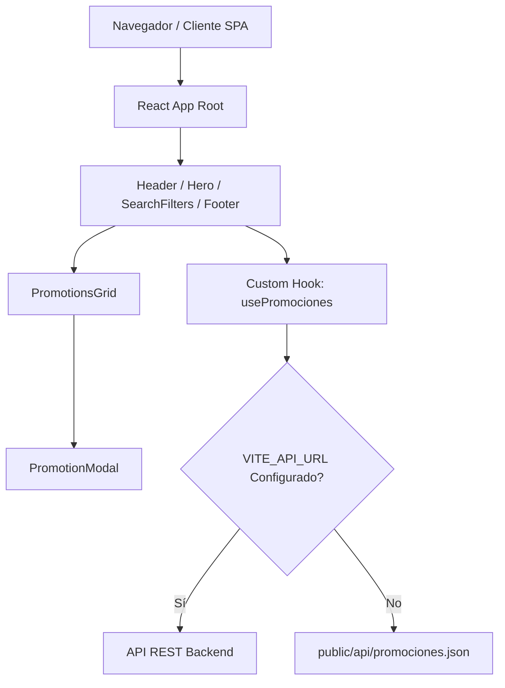
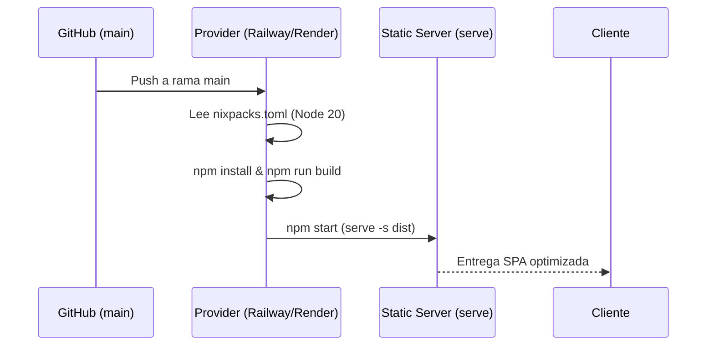

# Design Document (DESIGN.md) - Promotarjetas Web App 🚀

## 1. Contexto y Visión General
**Promotarjetas Web App** es una plataforma web (Single Page Application - SPA) de alto rendimiento orientada a la consulta, filtrado y exploración en tiempo real de beneficios, promociones y descuentos bancarios (por ejemplo, Banco Agrícola, BAC Credomatic, Banco Cuscatlán).

El proyecto combina un diseño moderno, micro-animaciones accesibles y una arquitectura desacoplada para garantizar velocidad de carga, escalabilidad y mantenibilidad.

---

## 2. Objetivos del Sistema & Principios de Diseño
- **Experiencia de Usuario Inmersiva (UX/UI):** Interfaz intuitiva y atractiva con jerarquía visual clara, paleta de colores cálida/balanceada y transiciones fluidas.
- **Arquitectura Híbrida de Datos:** Posibilidad de consumir un endpoint REST productivo (`VITE_API_URL`) o una fuente local desacoplada (`/public/api/promociones.json`).
- **Rendimiento de Carga Extremo:** Bundle estático optimizado con Vite, carga asíncrona de imágenes y zero layout shift (CLS).
- **Adaptabilidad Responsive:** Experiencia fluida para dispositivos móviles, tablets y desktops.

---

## 3. Arquitectura del Sistema y Tecnologías



### Stack Tecnológico:
- **Core Frontend:** React 18 + TypeScript + Vite 6
- **Estilos:** Tailwind CSS v4 + @tailwindcss/vite
- **Iconografía:** Lucide React + Material Icons
- **Animaciones:** Motion / Radix UI Primitives / CSS Transitions
- **Despliegue & Serving:** Nixpacks (Node 20) + `serve` en entorno de producción

---

## 4. Modelo de Datos (`PromocionUnificada`)

El contrato de datos estándar unifica la estructura de promociones provenientes de distintos bancos:

```typescript
export interface PromocionUnificada {
  // Campos Obligatorios
  id: string;
  bancoOrigen: 'AGRICOLA' | 'BAC' | 'CUSCATLAN';
  titulo: string;
  descripcionBreve: string;
  urlImagen: string;
  nombreComercio: string;

  // Campos Opcionales / Extendidos
  restriccionesHtml?: string;
  categoria?: string;
  fechaInicio?: string;
  fechaFin?: string;
  porcentajeDescuento?: number;
  urlExterna?: string;
}
```

---

## 5. Diseño de Componentes e Interfaz

### 5.1. Componentes Principales
1. **`Header` ([Header.tsx](file:///home/diego/Documentos/proyectos/frontend-promotarjetas.site/src/app/components/layout/Header.tsx)):** Navegación principal, marca e indicadores.
2. **`Hero` ([Hero.tsx](file:///home/diego/Documentos/proyectos/frontend-promotarjetas.site/src/app/components/layout/Hero.tsx)):** Mensaje de bienvenida con llamados a la acción (CTA) y propuesta de valor.
3. **`SearchFilters` ([SearchFilters.tsx](file:///home/diego/Documentos/proyectos/frontend-promotarjetas.site/src/app/components/features/SearchFilters.tsx)):** Barra de búsqueda reactiva por texto libre, selector de bancos (Agrícola, BAC, Cuscatlán, Todos) y categorías.
4. **`PromotionsGrid` ([PromotionsGrid.tsx](file:///home/diego/Documentos/proyectos/frontend-promotarjetas.site/src/app/components/features/PromotionsGrid.tsx)):** Cuadrícula dinámica de tarjetas con estados de carga (skeletons), error y resultados vacíos.
5. **`PromotionModal` ([PromotionModal.tsx](file:///home/diego/Documentos/proyectos/frontend-promotarjetas.site/src/app/components/modals/PromotionModal.tsx)):** Modal detallado para visualizar términos, condiciones, código de descuento y enlace externo.
6. **`Footer` ([Footer.tsx](file:///home/diego/Documentos/proyectos/frontend-promotarjetas.site/src/app/components/layout/Footer.tsx)):** Enlaces de la plataforma y notas legales.

---

## 6. Estrategia de Filtrado y Estado Local

La gestión de estado combina hooks nativos de React con hooks de dominio:

- **Filtro Multi-Criterio:**
  - `bankMatch`: Coincidencia exacta o comodín "Todos".
  - `categoryMatch`: Coincidencia por categoría seleccionada.
  - `queryMatch`: Coincidencia por subcadena insensible a mayúsculas/minúsculas en `titulo` o `descripcionBreve`.
- **Navegación Interactiva:** Botón flotante `ScrollToTop` con aceleración por CSS hardware (`translate-y`, `opacity`).

---

## 7. Despliegue e Infraestructura (CI/CD)



---

## 8. Consideraciones Futuras
- **Persistencia de Favoritos:** Guardado local (`localStorage`) de promociones guardadas por el usuario.
- **Geolocalización:** Filtrado de beneficios basados en comercios cercanos al usuario.
- **Notificaciones PWA:** Alertas sobre vencimiento próximo de promociones de interés.
